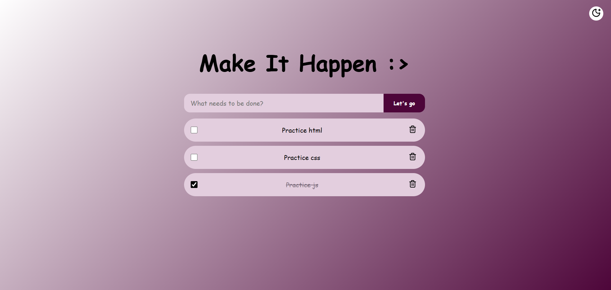

# 📝 Make It Happen :>

A simple and interactive **To-Do List** web application built with **HTML, CSS, and JavaScript**.

## 🌐 Live Demo

🔗 **[View Live Demo](https://elenahedayat.github.io/make-it-happen-todo-list/)**


## 📸 Screenshot 



## ✨ Features

* ➕ Add new tasks
* ✅ Mark tasks as completed
* 🗑️ Delete tasks
* 💾 Save tasks using Local Storage
* 🌙 Light / Dark mode
* 📱 Responsive design
* 🎨 Colorful and interactive UI
* 📭 Empty-state message when there are no tasks

## 🛠️ Technologies

* **HTML5** — Page structure
* **CSS3** — Styling, responsive design, animations, and themes
* **JavaScript** — Task management and user interactions
* **Local Storage** — Saving tasks in the browser

## 📁 Project Structure

```text
todo_list/
│
├── index.html
├── style.css
└── script.js
```

### `index.html`

Contains the structure of the To-Do List, including the input area, buttons, task list, and theme controls.

### `style.css`

Contains the styling, responsive layout, themes, colors, animations, and completed-task styles.

### `script.js`

Handles the main functionality of the application, including adding, completing, deleting, and storing tasks.

## 🚀 How to Run

No installation or additional dependencies are required.

1. Clone or download the project.
2. Open `index.html` in your browser.
3. Start adding your tasks! 🎯

## 💡 How It Works

Tasks are stored in the browser's **Local Storage**, so they remain available after refreshing the page.

Each task contains information such as its text, ID, and completion status.

```javascript
{
    id: "...",
    text: "Task name",
    completed: false
}
```

## 🎨 Theme

The application supports:

* ☀️ Light Mode
* 🌙 Dark Mode

The themes are managed using CSS variables.

## 📌 Future Improvements

Possible improvements for future versions:

* ✏️ Edit existing tasks
* 🔎 Filter tasks by status
* 🧹 Clear completed tasks
* 📅 Add deadlines
* 🏷️ Add categories or priorities
* ✨ Add more task animations

## 👩🏻‍💻 Author

**Elena Hedayat**

🔗 GitHub: **[elenahedayat](https://github.com/elenahedayat)**

---

⭐ If you like this project, feel free to give it a star!
